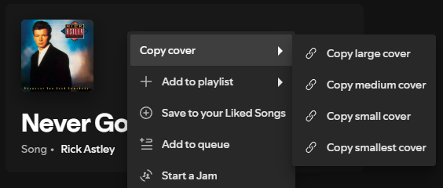

## Copy Track Cover

Filename: `Copy-to-clipboard.js`

An extension that lets you copy covers off of tracks.

## How to use

Right click the song you want to copy the cover of and select size.



Now the selected size of the cover should be added to your clipboard so you can paste it at any point in time.


## Install

Copy `Copy-to-clipboard.js` into your [Spicetify](https://github.com/khanhas/spicetify-cli) extensions directory:

| **Windows** | `%userprofile%\AppData\Roaming\spicetify\Extensions` |

After putting the extension file into the correct folder, run the following command to install the extension:

```sh
spicetify config extensions Copy-to-clipboard.js
spicetify apply
```

## Uninstall

To uninstall, run the following command:

```sh
spicetify config extensions Copy-to-clipboard.js-
spicetify apply
```

You can now delete the file in the extensions folder.
